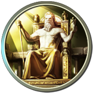

# Zeus

Sub theme for DGConnect websites

tpl.php templates are copied from Basic theme except field\*.tpl.php are from Drupal core

See also DAE-1849

#Add Zeus to project

Note: ensure you do not have duplicates of the zeus theme in different places in your project. This confuses the hell out of Drupal.

## Via drush make file

    projects[zeus][type] = "theme"
    projects[zeus][download][type] = "git"
    projects[zeus][download][url] = https://github.com/batigolix/zeus.git
    projects[zeus][branch] = "master"

Replace master with the branch name you want to include a specific version of the theme in your project. E.g. "release/1.2.3". See drush make docs for more info.

## Git clone

Clone the theme in a theme folder (e.g. lib/themes)

    git clone https://github.com/batigolix/zeus.git

## Phing command

For priviliged people there is a phing command available in the digital-agenda-dev project

    ./bin/phing clone-zeus
